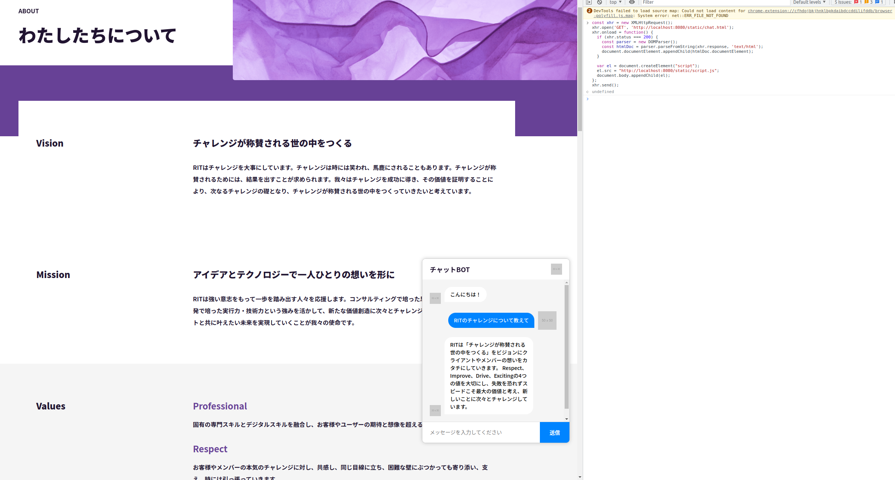

# Q&Aアプリ作成

openaiの公式ドキュメントのサンプルから作成したQ&Aアプリです。



[webサイトからQ&Aアプリ作成のチュートリアル](https://platform.openai.com/docs/tutorials/web-qa-embeddings)

## imageのビルド

``` bash

docker build -t openai-qa .

```

## containerの起動

``` bash

docker run -it --rm \
  -p 8080:8080 \
  -v $(pwd):/usr/src/app \
  --env OPENAI_API_KEY=<openaiのapiキーを設定>\
  openai-qa

```

## 適当なサイトで動作確認

適当なサイトを開いて、以下のコードを実行する。

``` javascript
const xhr = new XMLHttpRequest();
xhr.open('GET', 'http://localhost:8080/static/chat.html');
xhr.onload = function() {
  if (xhr.status === 200) {
    const parser = new DOMParser();
    const htmlDoc = parser.parseFromString(xhr.response, 'text/html');
    document.documentElement.appendChild(htmlDoc.documentElement);
  }

  var el = document.createElement("script");
  el.src = "http://localhost:8080/static/script.js";
  document.body.appendChild(el);
};
xhr.send();
```

## テストの実行

``` bash
docker run -it --rm \
  -v $(pwd):/usr/src/app \
  openai-qa \
  python -m unittest discover ./tests
```
